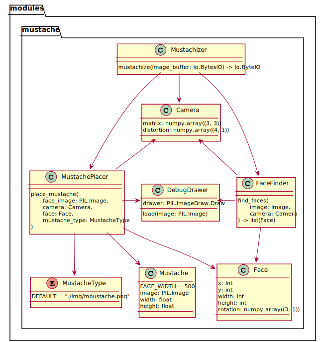

# [Stachebot](https://github.com/WildSiphon/Stachebot)

##  The Idea

The idea behind his project was to propose a solution to **mustachize as many faces as possible**. So we did it! 
And because it's funny and we like to share, we made it a twitter bot ([@RealStachBot](https://twitter.com/RealStachBot)) and a discord bot.

##  Installation

If you want to use our work locally, just follow instructions below :

### Using `requirements.txt`

```bash
git clone https://github.com/WildSiphon/Stachebot.git
cd Stachebot
pip install -r requirements.txt
```

### Using `Pipfile`

```bash
example
```

### Using `docker`

Just kidding, we haven't gone that far.

## Use

### Local use

If you want to mustachize your pictures by yourself, simply run `mustachizeLocally.py` :

```bash
~$ python3 mustachizeLocally.py "FILE"
```

**Options available**

```
usage: mustachizeLocally.py [-h] [-t [MUSTACHE_NAME]] [-o [OUTPUT_LOCATION]] [-l] [PATHS [PATHS ...]]

MUSTACHE THE WORLD!! Script to mustachize everything... or almost

positional arguments:
  PATHS                 path(s) to the file(s)

optional arguments:
  -h, --help            show this help message and exit
  -t [MUSTACHE_NAME]    choose mustache type (default is "random")
  -o [OUTPUT_LOCATION]  choose output location (default is "./output/")
  -l                    list all the mustaches types

supported media format: .png .jpeg .gif
```

### Twitter use

[@RealStachBot](https://twitter.com/RealStachBot) is already on twitter. If you want it to mustachize something, just tag it :

+ When you **post** a picture
+ In the **reply** of someone's picture

The bot doesn't mustachize when you tag it in a quote RT of a tweet with media.

You can publish your own bot based on our work if, and only if, <u>it brings something different to Twitter</u>. Otherwise make a pull request.
If you publish your own bot based on our work, please <u>link the project and our bot in the account description</u>.

### Discord use

We published the code for a discord bot but didn't make one public.
Feel free to use our project for personal use only, but <u>don't make a public bot with it</u>.

##  Code review

Now that all the script kiddies are trying to mustachize some stuff without reading more, we can talk about how the code works with y'all real mustache growers.

//Stuff with debug pictures and more

### Design

#### Class diagram



##  Stuff to add

+ ~~Creating `main.py` to mustachize locally~~
+ Improve output of `mustachizeLocally`
+ Finish the README
+ Comment all the code
+ Continue testing the mustachizer to be sure that it never crash 
+ Adding more sentences when bot is posting result of mustachisation
+ MORE MUSTACHES (maybe not… but maybe more)

## License

[GNU General Public License v3.0](https://www.gnu.org/licenses/gpl-3.0.fr.html)
