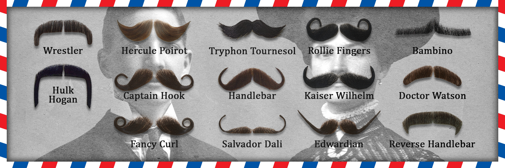

# [Stachebot](https://github.com/WildSiphon/Stachebot)

##  The Idea

The idea behind his project was to propose a solution to **mustachize as many faces as possible**. So we did it!
And because it's funny and we like to share, we made it a twitter bot ([@RealStachBot](https://twitter.com/RealStachBot)) and a discord bot.

##  Installation

If you want to use our work locally, just follow instructions below :

### Using `requirements.txt`

```bash
git clone https://github.com/WildSiphon/Mustachizer.git
cd Mustachizer
pip install -r requirements/mustachizer.txt
```

*Change the file name based on your usage. Choose between `mustachizer.txt`,`twitter_bot.txt` or `discord_bot.txt`*

### Using `Pipenv`

```bash
git clone https://github.com/WildSiphon/Mustachizer.git
cd Mustachizer
pipenv shell
```

### Using `docker`

Just kidding, we haven't gone that far.

## Use

### Local use

If you want to mustachize your pictures by yourself, simply run `mustachizer.py` :

```bash
~$ python3 mustachizer.py --show "FILE"
```

**Options available**

```
usage: mustachizer.py [-h] [-t [MUSTACHE_NAME]] [-o [OUTPUT_LOCATION]] [-l] [-s] [FILES [FILES ...]]

MUSTACHE THE WORLD!! Script to mustachize everything... or almost

positional arguments:
  FILES                 path(s) to the file(s)

optional arguments:
  -h, --help            show this help message and exit
  -t [MUSTACHE_NAME]    choose mustache type (default is "random")
  -o [OUTPUT_LOCATION]  choose output location (default is "./output/")
  -l, --list            list all the mustaches types
  -s, --show            show the mustachized media

supported media format: BAY, BW, CR2, CRW, DNG, EMF, EMZ, G3F, G3N, GIF, HDP, JFIF, JP2, JPC, JPE, JPEG, JPG, MRW, NEF, NRW, ORF, PCC, PDD, PEF, PNG, PXM, RAF, RAW, RLE, SCR, SRF, TARGA, WMF, X3F, XCF
```

**Mustaches available**



**Demo**

Mustachization works fine with image or gif…

### Twitter use

[@RealStachBot](https://twitter.com/RealStachBot) is already on twitter. If you want it to mustachize something, just tag it :

+ When you **post** a picture
+ In the **reply** of someone's picture

The bot doesn't mustachize when you tag it in a quote RT of a tweet with media.

You can publish your own bot based on our work if, and only if, ***it brings something different to Twitter***. Otherwise make a pull request.
If you publish your own bot based on our work, please ***link the project and our bot in the account description***.

### Discord use

We published the code for a discord bot but didn't make one public.
Feel free to use our project for personal use only, but ***don't make a public bot with it***.

##  Code review

Now that all the script kiddies are trying to mustachize some stuff without reading more, we can talk about how the code works with y'all real mustache growers.

The first toward mustachization is to detect the face.
This is done with a [Cascade Classifier](https://docs.opencv.org/4.5.3/db/d28/tutorial_cascade_classifier.html) (depicted in red in the following image).

The goal is to eliminate the big chunks of the image which don't contain any face.

The selected part of the image is then passed through a [Local Binary Feature Facemarker](https://docs.opencv.org/3.4.15/javadoc/org/opencv/face/FacemarkLBF.html) which is essentially an AI specialised in putting reference points on a face.

You can see the result here :


The facemarker outputs a lot of points which we ignore.

Our reference points are in blue on the picture.

We then map those points to a virtual face model using [Perspective N Points solving algorithm](https://shimat.github.io/opencvsharp_docs/html/64263f79-df37-20d6-0753-daf54d958ffe.htm).

It determines the rotation and translation of the face needed to match the two sets of points like shown in the following picture :


Beside, we compute a rectangle on the plane parallel to the face.
This rectangle is the mustache's bounding box.

We can now use the rotation and translation of the face to determine the perspective transformation matrix to apply to put the flat mustache image into the said box.

We can see the result here :


**Et voilà !**

You can now enjoy a pretty mustache !


### Design

#### Class diagram


##  Stuff to add

+ ~~Creating `mustachizer.py` to mustachize locally~~
+ Improve output of `mustachizer`
+ ~~Finish the README~~
+ ~~Comment all the code~~
+ ~~Implement gif support~~
+ Implement video support
+ Adding more sentences when bot is posting result of mustachisation
+ MORE MUSTACHES (maybe not… but maybe more)

## License

[GNU General Public License v3.0](https://www.gnu.org/licenses/gpl-3.0.fr.html)
